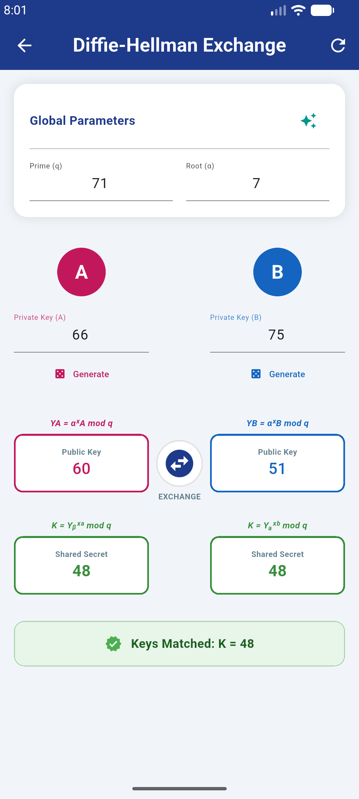
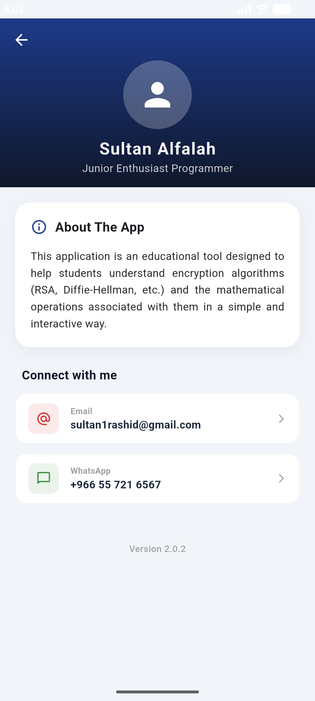

# Cryptography Toolkit 

**Cryptography Toolkit** It is an interactive educational tool developed using the **Flutter** framework, designed to simplify advanced programming concepts and transform complex mathematical equations into a tangible visual experience for developers and students.

---

## Key Features
* **Diffie-Hellman Key Exchange:**

A complete simulation of the key exchange process with a strict verification system for the Primitive Root.

* **RSA Encryption/Decryption:** 

An easy-to-use interface for performing calculations based on prime numbers.

* **Mathematical Accuracy:**

Precise handling of large numbers (BigInt) to ensure programmatically and mathematically correct results.

* **Modern UI:**

A modern design based on the color identity of the third group, offering a smooth user experience (UX).

* **Direct Contact:**

The ability to communicate directly with the developer via integrated contact methods.

---

## Screenshots

| D-H Key Exchange Screen | About me Screen |
| :---: | :---: |
|  |  |

---

## App Installation (Android)

You can try the application directly on your Android device by downloading the stable **APK** version:

[📥 Cryptography Toolkit v2.0.2](https://github.com/srfalah/Cryptography-Toolkit/releases/download/V2.0.2/app-release.apk)
> *I have removed old versions which were only a simple calculator with no algorithms.*

* لإخ لإق 
* For IOS users you can try the app using Flutter web platform:

[🌐 Try the web version](https://srfalah.github.io/Cryptography-Toolkit/)
---

## Tech Stack

* **Framework:** Flutter (Dart)
* **Logic:** Discrete Mathematics & Modular Arithmetic
* **Icons:** FlatIcon & Flutter Launcher Icons
* **Deployment:** Android (APK)

---

## About me

**Sultan Alfalah**
*Junior Enthusiast Programmer*

I welcome collaboration and suggestions

---
